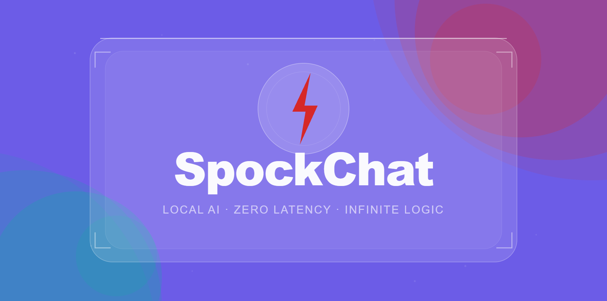

# SpockChat




> **Local-first, peer-to-peer AI chat. Zero cloud. Zero latency. Infinite logic.**

[](https://github.com/YOUR_USERNAME/spockchat/releases/tag/v1.0.0)
[](https://www.gnu.org/licenses/agpl-3.0)
[](https://nodejs.org)
[](https://ollama.com)

SpockChat lets you run group chats and 1v1 AI conversations entirely on your own hardware. No accounts, no servers, no data leaving your machine. Every message is local. Every AI call goes to your own Ollama instance. The only thing shared is your local network IP.

**This is v1.0.0 — the foundation release.** Active development is ongoing. Feature patches and version updates are coming soon. See the [Roadmap](#roadmap) section for what's next.

---

## Features

- **1v1 AI Chat** — private conversation with a local Ollama model
- **Group Chat** — up to 5 humans sharing one AI model per group
- **@AI mentions** — tag the AI mid-conversation for context-aware answers; it reads the last 40 messages before responding
- **Real-time messaging** — Socket.io, no polling
- **Peer-to-peer networking** — each machine runs its own server and connects to others by IP
- **Friend system** — add friends by their server address, send and accept invites
- **Local auth** — bcrypt-hashed passwords, JWT sessions, nothing stored remotely
- **Persistent chat history** — SQLite, survives restarts
- **Glassmorphism UI** — clean, no-framework frontend

---

## Download & Install

### Option A — Download the release zip (no git required)

1. Go to the [Releases page](https://github.com/YOUR_USERNAME/spockchat/releases/tag/v1.0.0)
2. Under **Assets**, download `spockchat-v1.0.0.zip`
3. Unzip it anywhere on your machine
4. Open a terminal in the unzipped folder and follow the setup steps below

### Option B — Clone with git

```bash
git clone https://github.com/YOUR_USERNAME/spockchat.git
cd spockchat
```

---

## Prerequisites

| Requirement | Version | Where to get it |
|---|---|---|
| Node.js | **22.5 or higher** | [nodejs.org](https://nodejs.org) |
| Ollama | Latest | [ollama.com](https://ollama.com) |
| A local LLM | any | `ollama pull llama3` |

> **Why Node 22.5+?** SpockChat uses the built-in `node:sqlite` module introduced in Node 22.5. No native compilation, no build tools needed.

---

## Setup

### 1. Install dependencies

```bash
npm install
```

### 2. Configure environment

```bash
# Windows
copy .env.example .env

# Mac / Linux
cp .env.example .env
```

Open `.env` and set a secret key:

```env
PORT=3000
JWT_SECRET=pick-any-long-random-string-and-put-it-here
```

### 3. Pull an AI model (one-time)

```bash
ollama pull llama3
```

Other options: `mistral`, `gemma`, `phi3`, `llama3.2`, `deepseek-r1` — anything Ollama supports works.

### 4. Start Ollama

```bash
ollama serve
```

Keep this running in a separate terminal. SpockChat will call it automatically when AI is triggered.

### 5. Start SpockChat

```bash
npm start
```

You'll see:

```
╔══════════════════════════════════════════╗
║             SpockChat v1.0.0             ║
╠══════════════════════════════════════════╣
║  Local:    http://localhost:3000         ║
║  Network:  http://192.168.1.42:3000      ║
╚══════════════════════════════════════════╝
```

Open **http://localhost:3000** in your browser.

---

## First Run Walkthrough

1. **Register** — click "New here? Create account", enter a username and password
2. **Create a group** — click **+ New Group Chat**, give it a name, enable AI, pick a model
3. **Send a message** — it saves to local SQLite and broadcasts via socket
4. **Try AI** — type `@AI explain how TCP handshakes work` and watch it respond with your chat as context
5. **Invite someone** — click the **＋** icon → Add Friend → enter their server IP and username → they accept → invite them to your group

---

## Connecting with Friends

SpockChat is federated. Every person runs their own server. There is no central host.

### Same WiFi (LAN)

Share the **Network** address printed at startup (e.g. `http://192.168.1.42:3000`). Anyone on the same network can open it in their browser and register an account on your server, or you can point them at their own running instance.

### Different networks (across the internet)

You need to make your server reachable. Two options:

**Option A — ngrok (easiest, no router config):**
```bash
npx ngrok http 3000
```
Copy the `https://xxxx.ngrok.io` URL and share it. Free tier is fine for personal use.

**Option B — Port forwarding:**
Forward port `3000` on your router to your machine's local IP. Share your public IP. Your friends connect to `http://YOUR_PUBLIC_IP:3000`.

### The friend add flow

1. Click **＋** in the sidebar header → **Add Friend**
2. Enter their server address and their username
3. They get a notification on their end
4. Once accepted, you can invite each other to group chats

---

## How the AI works

SpockChat calls your local Ollama instance directly — no API keys, no rate limits, no cost.

- **1v1 chats**: your messages go straight to Ollama with a system prompt
- **Group chats**: when someone types `@AI`, the last 40 messages are bundled as context and sent along with the question
- **AI runs on the group admin's machine** — the admin's Ollama instance handles all AI for that group
- Typing indicators show while the model is generating
- Responses are saved to the local DB like any other message

Supported Ollama models: anything you've pulled — `llama3`, `mistral`, `gemma`, `phi3`, `deepseek-r1`, `qwen`, etc.

---

## Project Structure

```
spockchat/
├── server/
│   ├── index.js              # Express + Socket.io bootstrap, server startup
│   ├── db.js                 # SQLite schema, all query functions
│   ├── middleware/
│   │   └── auth.js           # JWT sign/verify middleware
│   ├── routes/
│   │   ├── auth.js           # /api/auth — register, login, token validation
│   │   ├── chats.js          # /api/chats — CRUD, messages, invites
│   │   ├── friends.js        # /api/friends — add by IP, federation endpoint
│   │   └── ai.js             # /api/ai — Ollama calls, model listing, status
│   └── socket/
│       └── handlers.js       # Real-time events: messages, typing, @AI trigger
├── client/
│   └── index.html            # Full UI — glassmorphism + Socket.io + REST client
├── .env.example
├── .gitignore
├── package.json
└── README.md
```

---

## API Reference

### Auth
| Method | Path | Body | Auth required |
|---|---|---|---|
| POST | `/api/auth/register` | `{username, password}` | No |
| POST | `/api/auth/login` | `{username, password}` | No |
| GET | `/api/auth/me` | — | Yes |

### Chats
| Method | Path | Notes | Auth required |
|---|---|---|---|
| GET | `/api/chats` | List user's chats | Yes |
| POST | `/api/chats` | Create chat | Yes |
| GET | `/api/chats/:id` | Chat details + members | Yes |
| GET | `/api/chats/:id/messages` | Message history | Yes |
| POST | `/api/chats/:id/invite` | Invite a friend | Yes |
| PATCH | `/api/chats/:id/ai` | Update AI config | Yes, admin only |
| GET | `/api/chats/invites/pending` | Pending invites | Yes |
| POST | `/api/chats/invites/:id/respond` | Accept or reject | Yes |

### Friends
| Method | Path | Body | Auth required |
|---|---|---|---|
| GET | `/api/friends` | List accepted friends | Yes |
| POST | `/api/friends/add` | `{peerHost, peerUsername}` | Yes |
| POST | `/api/friends/:username/respond` | `{action: accept/reject}` | Yes |

### AI
| Method | Path | Notes |
|---|---|---|
| GET | `/api/ai/models?host=...` | List models from Ollama |
| GET | `/api/ai/status?host=...` | Check if Ollama is reachable |
| POST | `/api/ai/ask` | Direct 1v1 query |

### Federation (peer-server calls)
| Method | Path | Purpose |
|---|---|---|
| POST | `/api/federation/friend-request` | Receive friend request from another SpockChat server |
| GET | `/api/federation/lookup/:username` | Verify a user exists on this server |

---

## Security Notes

- Passwords hashed with bcrypt (cost factor 12)
- JWT tokens expire after 30 days
- All data stays in a local SQLite file — nothing is transmitted to any third party
- The federation endpoints (`/api/federation/*`) are unauthenticated by design — they only write to your local DB and emit socket events; they cannot read data
- **Change `JWT_SECRET` in `.env` before sharing your network address with anyone**
- For public internet exposure, put SpockChat behind a reverse proxy (nginx, Caddy) with HTTPS

---

## Roadmap

This is v1.0.0. The foundation is stable. Here's what's coming:

### v1.1 — Quality of life
- [ ] Message search across chat history
- [ ] File and image sharing
- [ ] Model hot-swap without recreating the group
- [ ] mDNS auto-discovery for LAN — find friends without typing IPs
- [ ] Unread message badges per chat

### v1.2 — Power features
- [ ] AI persona customization per chat (name, system prompt, temperature)
- [ ] Chat export to markdown
- [ ] Admin can mute/remove members
- [ ] Multiple AI models in one group (each member can query their own)

### v2.0 — Major release
- [ ] End-to-end encryption for messages
- [ ] Electron desktop app (Windows, Mac, Linux installers)
- [ ] Mobile-optimized UI
- [ ] Chat import/export for moving between machines

Have a feature idea? Open an issue or a discussion on GitHub.

---

## Contributing

SpockChat is licensed under AGPL-3.0. Contributions are welcome.

1. Fork the repo
2. Create a branch: `git checkout -b feature/your-feature`
3. Make your changes
4. Open a pull request with a clear description

Please keep PRs focused — one feature or fix per PR. If you're planning something large, open an issue first to discuss it.

---

## License

**GNU Affero General Public License v3.0 (AGPL-3.0)**

Copyright © 2025 SpockChat Contributors

SpockChat is free software: you can redistribute it and/or modify it under the terms of the GNU Affero General Public License as published by the Free Software Foundation, either version 3 of the License, or (at your option) any later version.

SpockChat is distributed in the hope that it will be useful, but WITHOUT ANY WARRANTY; without even the implied warranty of MERCHANTABILITY or FITNESS FOR A PARTICULAR PURPOSE. See the GNU Affero General Public License for more details.

You should have received a copy of the GNU Affero General Public License along with this program. If not, see [https://www.gnu.org/licenses/agpl-3.0](https://www.gnu.org/licenses/agpl-3.0).

> **What AGPL-3.0 means in practice:** You can use, modify, and self-host SpockChat freely. If you distribute a modified version — including running it as a network service for others — you must release your modifications under the same license. You cannot take this code, make it proprietary, and sell it as a closed product.